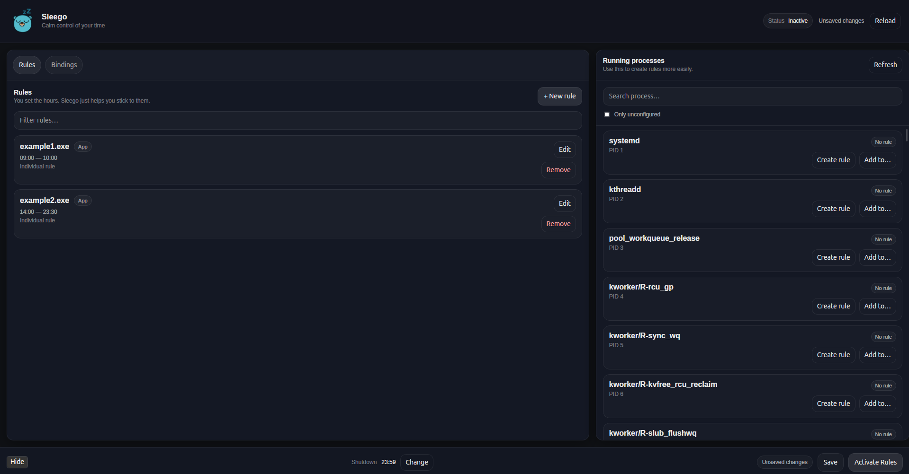

# Sleego UI


This repository contains the **desktop user interface** for Sleego.

Sleego itself is a small system that enforces self-defined time boundaries on computer usage.
The **core engine** (rules, process control, shutdown logic) lives in a **separate repository** and can be used independently.

👉 Core repository:
[https://github.com/joaogabriel01/sleego](https://github.com/joaogabriel01/sleego)

This project focuses only on the **desktop interface**.

---

## What this UI is for

The UI exists to make the Sleego core usable on a daily basis.

It allows you to:

* visualize the current rules
* configure application schedules
* manage categories
* see warnings and alerts
* understand what the system is doing

It does **not** implement business logic or enforcement by itself.

---

## Interface

Below are a few screenshots of the current interface.

The UI is intentionally minimal and designed to be opened only occasionally — usually when adjusting rules.

> Note: visuals may evolve, but the core behavior is meant to stay predictable.



---

## What Sleego does (via the core)

The UI exposes the following core features:

### System shutdown

* A fixed shutdown time can be configured
* The system receives advance warnings
* Shutdown happens automatically at the configured time

This represents a clear “end of day” boundary.

---

### Application scheduling

Each application can have an allowed time window.

Example:

```
browser → 09:00 to 18:00
game   → 20:00 to 23:30
```

Outside the allowed window, the application is terminated by the core.

This is based on **time intervals**, not accumulated usage.

---

### Categories

Applications can be grouped into logical categories, such as:

* Work
* Study
* Games

A category behaves like an application rule and applies to all applications inside it.

---

### Alerts

Alerts are informational and non-intrusive.

They exist to communicate what will happen before it happens.

---

## Architecture

This repository contains **only the UI layer**.

* **Sleego Core** (separate repository)

  * rule engine
  * process monitoring
  * shutdown logic
  * configuration persistence

* **Sleego UI** (this repository)

  * desktop interface (Wails)
  * configuration editing
  * state visualization
  * user-facing alerts

The UI depends on the core, not the other way around.

---

## Installation

### Build

```bash
make build
```

### Install

```bash
make install
```

### Uninstall

```bash
make uninstall
```

User configuration is preserved during uninstall.

---

## Configuration

The UI uses the same configuration file managed by the core.

On Linux:

```
~/.config/sleego/config.json
```

On Windows:
```
%APPDATA%\Sleego\config.json
```

The configuration file is expected to exist and is managed by the UI.”


## License

This project is licensed under the MIT License.
